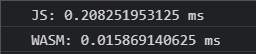

# WebAssembly: Como e por que?

## NÃO!!
Antes de tudo, webassembly não é somente assembly como vem a cabeça de muitos ao ler isto pela primeira vez, ninguém vai sofrer escrevendo na linguagem de programação mais baixo nível da vida, o webassembly, nada mais é do que um bytecode que permite utilizar linguagens além do JS no navegador, permitindo uma maior performance e trazendo uma série de mudanças na forma como sempre vinhamos trabalhando com a web.

## Background
Como muitos sabem, a web hoje é full Javascript, não importa se tu usa Typescript, ou se usa alguma outra linguagem, no final tudo é transpilado em javascript, pois é ela que possui acesso a DOM, Storage, WebSockets, dentre outras api do navegador, e tem sido assim por muito tempo, entretanto, o javascript por mais que seja uma linguagem linda que evoluiu muito ao decorrer dos anos, ela possui algumas limitações tais como:

- Single thread, ou seja, não é boa para multitask
- Ser baseada em texto requer maior carregamento de dados o que resulta em maior tempo de inicialização da página
- A otimização do JIT para a interpretação consome CPU e bateria dos devices
- Necessidade de reescrever bibliotecas existentes que não estejam escritas em JS

## E agora quem poderá nos defender?
O WebAssembly, que a partir de agora vamos chamar apenas de WASM, é um bytecode interpretado pelo browser, que permite o uso de apis nativas e um processamento como se fosse uma aplicação instalada na maquina do usuário, e permitindo o uso de linguagens que não sejam o javascript para trabalhar com a web.

Algumas das features mais fortes do WASM são:

- É um bytecode, ou seja, NINGUÉM escreve um bytecode, mas sim usa alguma outra linguagem para compilar em WASM
- É um formato binário, o que faz ser mais leve para ser carregado pelo navegador
- É interpretado diretamente pela máquina, sem necessidade da otimização do JIT, pois já é otimizado durante a compilação.
> Disclaimer: Um bytecode é um intermediário entre o código fonte e a aplicação final, onde ele será interpretado por uma máquina virtual, e não necessita de pré-processamento ou validação de sintaxe ou dados como os compiladores fazem, aumentando sua performance na execução e possibilitando a portabilidade entre diferentes arquiteturas.

## Como que usa isso?
Primeiramente para criar o bytecode precisamos decidir qual linguagem de programação iremos utilizar, pelo wasm ser compilado podemos utilizar as linguagens de baixo nivel mais populares, como C, C++, Rust, dentre outras, porém, desenvolvedores web por estarem muito acostumados com JS, faria muito sentido existir uma linguagem que se assemelhe a sintaxe do JS para fins de wasm, e para isso criou-se o assemblyscript, e é ele que utilizaremos para este exemplo.

## O AssemblyScript
O assemblyscript (AS) nada mais é do que uma linguagem baseada no typescript, que por sua vez é feito em cima do javascript, porém com uma tipagem de mais baixo nível, ou seja, ao invés de nos preocuparmos se é um number ou uma string tal como o TS funciona, no AS precisamos nos preocupar com a quantidade de memória, se é um numero inteiro ou flutuante, todas as questões relacionadas a máquina mesmo.

Obs: outra coisa também é que a estrutura mais conhecida do JS não pode ser utilizada que é o JSON, para isso devemos utilizar um MAP e informar quanto de memória ele terá, outras características sobre a linguagem podem ser acessadas em: https://www.assemblyscript.org/

## Exemplo
Para este exemplo, faremos uma simples função de fatorial escrito em AS e uma em JS para termos uma comparação.

```js title=main.ts
export function fact(n: i32): i32 {
  return n == 0 ? 1 : n * fact(n - 1);
}
```

Salvamos o código como main.ts e para compilar em wasm instalamos o assemblyscript globalmente com o npm

```bash
npm i -g assemblyscript
```

E depois rodamos o seguinte comando para fazer a compilação

```bash
asc -b main.wasm main.ts
```

Com isso teremos em nosso projeto um arquivo main.wasm

Agora criamos um index.html e um script.js para fazermos uso desse bytecode.

Colocamos no html apenas dois span para mostrar os valores calculados

```html title=index.html
<body>
      Fatorial com JS:
      <span class="js"></span>
      <br />
      Fatorial com WASM:
      <span class="wasm"></span>
</body>
```

No script.js implementamos o fatorial da mesma forma como no assemblyscript porém sem a tipagem, e também já aproveitamos para fazer a importação do WASM

```js title=index.js
async function loadWasmFunctions() {
  const response = await fetch("main.wasm");
  const buffer = await response.arrayBuffer();
  const { instance } = await WebAssembly.instantiate(buffer);
  return instance.exports;
}
function factJs(n) {
  return n == 0 ? 1 : n * factJs(n - 1);
}
const { fact } = await loadWasmFunctions();
document.querySelector(".js").innerText = factJs(12);
document.querySelector(".wasm").innerText = fact(12);
```

Ao rodar o arquivo podemos notar que possuímos os mesmo valores em ambos, ou seja de fato funcionou, nosso bytecode está sendo importando e funcionando no browser, mas você agora deve estar se fazendo a seguinte pergunta.


> Mas você está usando TS pra JS, isso esta só transpilando e esta dando toda uma volta sem nenhum sentido, qual a moral disso?

E é ai que você se engana, pois o wasm é REALMENTE um bytecode, se virmos agora a velocidade que levou pra executar.


Notamos que obtivemos uma diferença absurda em relação ao JS, o wasm consegue rodar pelo menos 10x mais rápido pois está utilizando todo o poder da máquina, se provando ter toda a vantagem de performance e abrindo novos horizontes para o desenvolvimento web.

## Devo usar o WebAssembly?
Como toda tecnologia a resposta sempre será um belo depende, mas por ter um foco em performance, o WASM é recomendado quando precisamos por exemplo fazer simulações, realizar muitos cálculos, quando queremos utilizar recursos nativos, tal como uma placas gráficas ou codecs de áudio, mas para e-commerce, blogs ou landing pages, não é muito recomendado o uso dele.

## Quem está por trás do WASM?
Uma das magias do WASM é que TODOS os grandes por trás dos browsers mais conhecidos, estão participando de seu desenvolvimento, o que promete um futuro bastante promissor sobre como a web vai se seguir daqui pra frente.

## Será essa a morte do javascript?
Não, o WASM por mais que tenha varias vantagens, ainda n possui acesso a DOM, e faz mais sentido ele trabalhar lado a lado com o JS, do que substitui-lo, trazendo todo um poder a mais para os desenvolvedores terem suas aplicações cada vez mais performáticas e leves para o usuário utilizar.
